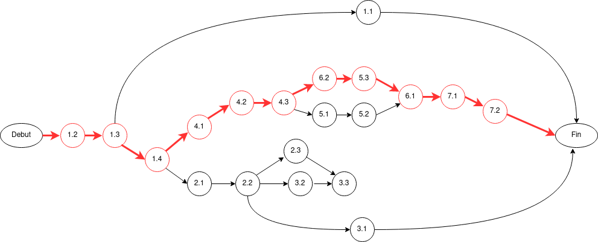
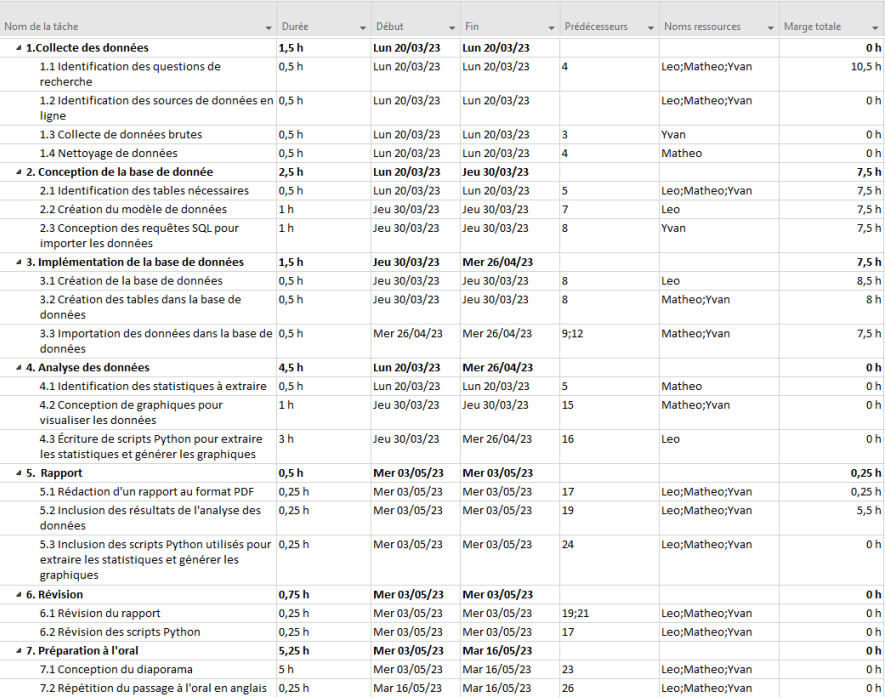
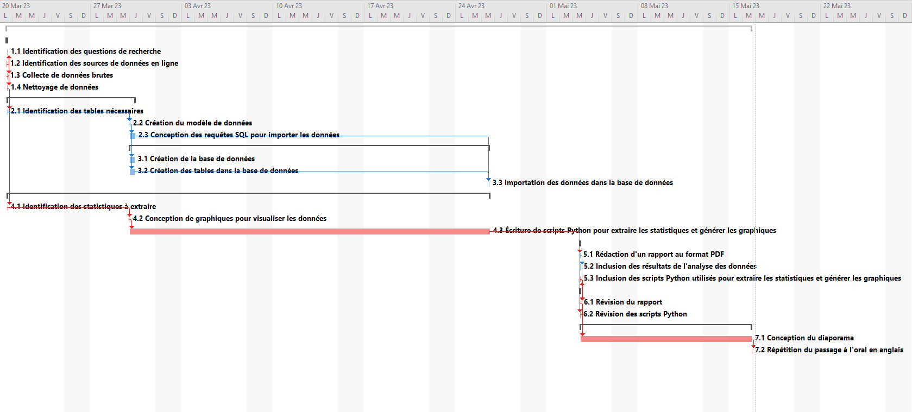
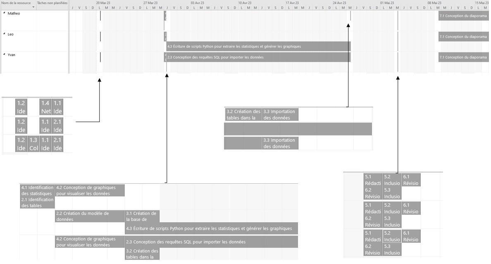
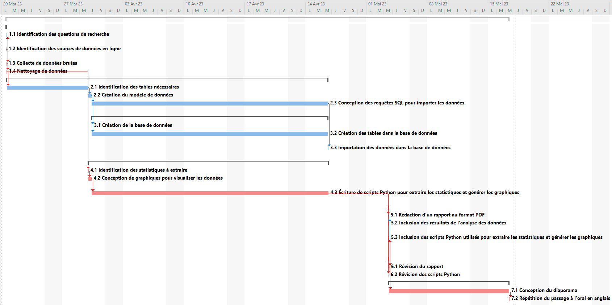

---
title: 'SAÉ 2.05 Gestion d’un projet'
author:
- Léo Tuaillon
- Mathéo Hersan
- Yvan Calatayud
date: 'Mai 2023'
lang: fr-FR
...

\tableofcontents
----------------

# 1. Présentation Générale du projet :

Contexte
----------

Notre SAE consistait à manipuler et à analyser un jeu de données libres et ouvertes. Pour ce faire, nous avons sélectionné un jeu de données csv des chansons les plus écoutées sur Spotify.

L'objectif de notre projet était d'exploiter ces données pour en extraire des informations pertinentes, des graphiques et des statistiques. Nous avons commencé par trouver des questions sur ces données et définir les statistiques que nous souhaitions obtenir. Par exemple, nous avons cherché à comprendre les tendances du marché musical, à identifier les artistes les plus populaires ou à prévoir la popularité future d'une chanson en fonction de son style et de sa durée.

Après avoir défini nos questions, nous avons proposé un modèle de structuration de nos données. Nous avons utilisé des outils numériques pour analyser les données et créer une base de données. Ensuite, nous avons rédigé un script pour importer les données collectées dans notre base de données, en veillant à traiter les données au préalable pour supprimer les doublons ainsi que les données incohérentes.

Enfin, nous avons analysé nos données et les avons présenté sous forme visuelle avec des graphiques explicites pour répondre aux questions que nous avons identifiées dans la première partie. Cette présentation c'est faite par un compte rendu écris ainsi qu'avec un oral ou nous avons eu à expliquer et détailler nos résultat en anglais.

Genèse de projet
---------

Bien que ce projet nous ait été assigné par notre professeur, il est facile d'imaginer une entreprise ou un client qui pourrait bénéficier d'un tel projet. Une maison de disques, par exemple, serait intéressée par une analyse approfondie des tendances musicales et des goûts des auditeurs. Ces informations pourraient influencer leurs décisions en matière de marketing et de promotion, en ciblant plus efficacement leur public et en adaptant leur offre musicale aux préférences du marché.

Ou de même, Spotify lui-même, ou d'autres plateformes de streaming musical, pourraient trouver une telle analyse utile pour mieux comprendre leurs utilisateurs, optimiser leurs algorithmes de recommandation et améliorer l'expérience utilisateur.

Maître d'oeuvre, d'ouvrage et de projet
---------

En tant que maître d'œuvre, nous avons la responsabilité de la conception et de la réalisation du projet. Nous avons décidé ensemble des méthodes à adopter, des outils à utiliser et du calendrier à respecter pour mener à bien notre mission.

Le maître d'ouvrage est notre professeur, M. Azemar, qui nous a confié ce projet. Il définit les objectifs et les contraintes du projet, valide les choix techniques et s'assure que le résultat correspond à ses attentes.

Pour organiser notre équipe, nous avons opté pour une approche collaborative plutôt que hierarchique. En d'autres termes, il n'y avait pas à proprement parler de chef d'équipe. Nous avons préféré mettre en place une structure horizontale, où chacun avait la possibilité d'exprimer ses idées et où les décisions ont été prises de manière consensuelle. Cette approche a facilité la communication et la collaboration au sein de l'équipe, en permettant à chacun de contribuer à part égale à la réussite du projet et de donner son avis sans mauvaise apréhension.

Chacun de nous a été chargé de certaines tâches en fonction de ses compétences et de ses intérêts. Cette répartition des rôles a permis d'optimiser notre travail en tirant parti de nos forces individuelles, tout en veillant à ce que chaque membre de l'équipe ait une compréhension globale du projet.

Nous avons organisé des réunions au début de chaque séance. Durant ces réunions, chacun présentait l'avancement de sa tâche en cours et nous discutions ensemble de la suite du projet. Ces moments ont été essentiels pour maintenir une bonne communication au sein de l'équipe, pour résoudre les problèmes rapidement et pour prendre des décisions validés par tous.

Pour faciliter notre communication et notre collaboration, nous avons choisi d'utiliser plusieurs outils. Les outils Notion et Git du codefirst ont été nos principals outils de gestion de projet, nous permettant de suivre l'avancement du projet, de partager des ressources et de planifier nos tâches. Enfin, pour la communication en temps réel lorsque nous travaillions, nous avons utilisé Discord, qui offre des fonctionnalités de chat et d'appel vidéo. Ces outils ont été choisis pour leur facilité d'utilisation et leur capacité à favoriser la collaboration à distance en cas d'absence de l'un d'entre nous.

Livrables
-----------------------------

À la fin de notre SAE, nous avons livré plusieurs éléments :

- Une base de données bien structurée contenant les données des chansons les plus écoutées sur Spotify. Cette base de données a été nettoyée et est prête à être utilisée pour d'autres analyses ou projets.
- Un ensemble de scripts Python que nous avons utilisés pour collecter, nettoyer et analyser les données. Ces scripts sont documentés afin de pouvoir être repris pour d'autres projet ou si un autre développeur avait à y retoucher quelque chose.
- Un rapport détaillé présentant notre méthodologie, nos résultats et nos conclusions. Ce rapport comprend des graphiques et des statistiques pour illustrer nos découvertes.
- Une présentation visuelle de nos résultats (Compte rendu + Oral en anglais).

Niveau de confidentialité
-------------------------

Si un client réel nous avait demandé un tel projet, le niveau de confidentialité aurait été relativement faible, étant donné que nous travaillons avec un jeu de données public trouvé sur Internet. Cependant, il est important de noter que même si les données sont publiques, nous avons toujours une responsabilité envers notre client et envers les utilisateurs de Spotify de respecter leur vie privée et de ne pas utiliser les données de manière abusive.

De plus, si le client avait des données supplémentaires qu'il souhaitait que nous intégrions à notre analyse (par exemple, des données d'écoute spécifiques à leur entreprise), le niveau de confidentialité aurait été plus élevé. Dans ce cas, nous aurions mis en place des mesures de sécurité supplémentaires pour protéger ces données et respecter le RGPD, comme avec l'utilisation de protocoles de chiffrement et la limitation de l'accès aux données uniquement aux personnes habilités.

Diagramme bête à corne
----------------------

Diagramme pieuvre
-----------------

# 2.Plannification du projet :

WBS
------------------

Contraintes pesant sur la réalisation des tâches
----------

1. **Contrainte de temps :**
La première contrainte que nous avons rencontrée est la contrainte de temps. Nous avions une durée limitée pour réaliser ce projet, ce qui a nécessité une planification rigoureuse et une gestion efficace du temps. Chaque étape du projet, de la collecte des données à la rédaction du rapport, devait être réalisée dans un délai précis pour garantir que nous respecterions le calendrier global du projet.

2. **Contrainte de qualité :**
La qualité de notre travail était une autre contrainte importante. Nous devions nous assurer que nos analyses étaient précises et que nos résultats étaient présentés de manière claire et compréhensible. Cela a nécessité une attention particulière aux détails lors de la collecte et de l'analyse des données, ainsi qu'un effort considérable pour la présentation visuelle des résultats.

3. **Contrainte de coûts :**
Bien que ce projet ait été réalisé dans un contexte académique et n'ait donc pas impliqué de coûts financiers directs, nous avons dû tenir compte des coûts potentiels si ce projet avait été réalisé dans un contexte professionnel. Par exemple, le coût des développeurs, des logiciels, de l'hébergement des données, et des locaux et de l'électricité auraient dû être pris en compte dans le budget du projet.

4. **Contrainte de compétences :**
Une autre contrainte était liée aux compétences de l'équipe. Chaque membre de l'équipe avait des compétences et des intérêts différents, et nous avons dû nous assurer que les tâches étaient réparties de manière à tirer le meilleur de chacun. Cela a nécessité une bonne communication et une coordination au sein de l'équipe.

5. **Contrainte de confidentialité :**
Pas vraiment de contrainte de confidentialité pour nous car le jeu de donnée était publique mais comme nous l'avons déjà expliqué précédemment, si nous avions été dans un contexte plus professionnel ou avec des  données plus sensibles la contrainte de confidentialité aurait été plus élevé et aurait nécessité plus d'attention de notre part.

Ressources néssaires à la réalisation du projet :
-----------------

Si ce projet avait été réalisé pour une entreprise et non pas dans le cadre d'une SAE, il aurait nécessité un long développement informatique et de rémunérer les 3 développeurs. Il aurait aussi fallait répercuter le coût moyen en ordinateur et matériel informatique ainsi que l'électricité.

Tableau des coûts prévisionnel :
-----------------

Dates jalons
------------

Les tâches de documentation marquent la fin des étapes importantes. Elles marquent l'aboutissement d'un cycle de développement.

Réseau PERT :

PERT temps :

GANTT Prévisionnel : 

Planning des ressources optimisés :

Indicateurs de suivi :
--------------------

## Avancement des tâches

L'avancement des tâches est un indicateur clé pour le suivi de notre projet. Il nous permet de mesurer notre progression et d'identifier rapidement les retards ou les problèmes potentiels.

Nous avons utilisé les tickets Git sur CodeFirst et Notion pour suivre l'avancement des tâches. Ces outils nous ont permis de visualiser l'état de chaque tâche et l'avancement global du projet à tout moment.

Nous avons vérifié l'avancement des tâches à chaque réunion d'équipe, qui avait lieu au début de chaque séance de travail. Cela nous a permis de discuter de la progression de chaque tâche, d'identifier les problèmes ou les retards, et de prendre des décisions sur les prochaines étapes.

# 3.La Comparaison prévisionnel/Réel :

Comparaison du GANTT prévisionnel au GANTT réel
----------

En comparant le diagramme de GANTT prévisionnel à celui réel, nous avons constaté des écarts dans l'exécution de certaines tâches. Plus précisément, nous avons rencontré un retard dans la réalisation de la tâche 2.1 : "Identification des tables nécessaires". Ce retard a eu un effet en cascade sur les tâches suivantes, à savoir 2.3 "Conception des requêtes SQL pour importer les données", 3.2 "Création des tables dans la base de données" et 4.1 "Identification des statistiques à extraire".

L'origine de ce retard est due à la complexité de l'identification des tables nécessaires pour notre base de données. Nous avons dû passer plus de temps que prévu pour comprendre les relations entre les différentes données et pour définir une structure de base de données optimale. Cela a nécessité une analyse plus approfondie et des discussions supplémentaires au sein de l'équipe.

Cependant, malgré ce retard, nous avons réussi à rattraper le temps perdu et à terminer le projet dans les délais prévus. Cela a été possible grâce à une bonne gestion de projet et à une répartition efficace des tâches par la suite. Nous avons également bénéficié d'une certaine flexibilité dans notre planning, ce qui nous a permis d'absorber ce retard sans impacter les autres tâches.

En conclusion, bien que nous ayons rencontré des écarts entre notre planification prévisionnelle et la réalité, nous avons su nous adapter et gérer ces imprévus de manière efficace. Cela démontre l'importance d'une bonne gestion de projet et la nécessité d'avoir une certaine flexibilité dans la planification pour faire face aux imprévus.

Analyse de l'organisation de l'équipe
--------

Notre organisation d'équipe a globalement tenu la route tout au long du projet. Malgré le retard rencontré lors de l'identification des tables nécessaires pour notre base de données, nous avons réussi à rebondir et à terminer le projet dans les délais prévus. Cela a été possible grâce à une bonne communication au sein de l'équipe, une répartition efficace des tâches et une gestion de projet rigoureuse.

Cependant, avec le recul, nous aurions pu améliorer notre organisation en anticipant davantage les tâches qui pourraient potentiellement nécessiter plus de temps que prévu. En identifiant ces tâches dès le début du projet, nous aurions pu leur allouer une marge plus importante dans notre planification, ce qui aurait permis de minimiser l'impact de tout retard sur le reste du projet.

En ce qui concerne les outils utilisés, nous sommes globalement satisfaits. Notion et Git ont été des outils précieux pour la gestion de notre projet. Ils nous ont permis de suivre l'avancement du projet, de partager des ressources et de planifier nos tâches de manière efficace. De plus, Discord a facilité notre communication en temps réel, ce qui a été particulièrement utile lors des sessions de travail à distance.

### CONCLUSIONS :

Yvan Calatayud :
----------------
Je suis plutot satisfait de notre gestion de projet. Malgré quelques retards, nous sommes parvenus à achever le projet dans les délais impartis et à produire un travail de qualité. J'ai remarqué que l'utilisation de Notion et Git a grandement facilité la gestion de notre projet. Ces outils nous ont permis de rester organisés, de suivre notre progression et de collaborer de manière efficace. Pour le projet de l'année prochaine, j'aimerais certainement continuer à utiliser ces outils. Cependant, je pense que nous pourrions améliorer notre gestion du temps en identifiant plus tôt les tâches qui pourraient nécessiter davantage de temps et en leur accordant une marge plus importante dans notre planification.

Mathéo Hersan :
----------------

En réfléchissant à notre gestion de projet, je suis globalement satisfait de la façon dont les choses se sont déroulées. Nous avons rencontré quelques défis, notamment un retard dans l'identification des tables nécessaires pour notre base de données, mais nous avons réussi à surmonter ces obstacles et à terminer le projet à temps. J'ai trouvé que notre communication ouverte et régulière était l'un des aspects les plus forts de notre équipe. Pour le projet de l'année prochaine, je voudrais continuer à prioriser la communication et la collaboration. Cependant, je pense que nous pourrions bénéficier d'une meilleure anticipation des tâches potentiellement difficiles et d'une allocation de temps plus généreuse pour ces tâches.

Léo Tuaillon :
--------------

En tant que membre de cette équipe, je suis fier de ce que nous avons accompli. Nous avons réussi à mener à bien ce projet complexe dans un délai relativement court, malgré quelques obstacles encourrus. J'ai particulièrement apprécié notre approche collaborative, qui a permis à chacun de nous de contribuer de manière significative au projet. Les outils que nous avons utilisés, notamment Notion et Git, ont été essentiels pour nous aider à rester organisés et à suivre notre progression. Pour le projet de l'année prochaine, je voudrais continuer à utiliser ces outils et à travailler dans un environnement d'équipe collaboratif. Cependant, je pense que nous pourrions améliorer notre planification en identifiant plus tôt les tâches qui pourraient nécessiter plus de temps.

